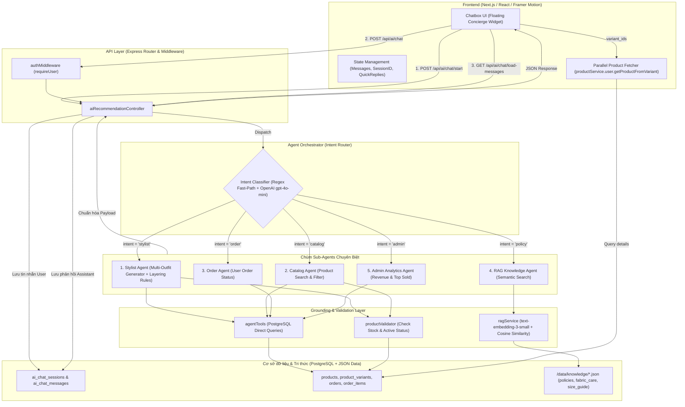

# BÁO CÁO TOÀN DIỆN VỀ HỆ THỐNG VÀ LUỒNG XỬ LÝ AI CHATBOT (LUNA STYLIST CONCIERGE)

---

## 1. TỔNG QUAN HỆ THỐNG (SYSTEM OVERVIEW)

Hệ thống Chatbot AI (tên đại diện: **Luna - Fashion Stylist & Concierge** của thương hiệu thời trang **HS Atelier**) được xây dựng theo kiến trúc **Mô hình Đa tầng Agent (Hierarchical Multi-Agent Architecture)** kết hợp kỹ thuật **RAG (Retrieval-Augmented Generation)** và cơ chế **Database Grounding & Anti-Hallucination** (Chống ảo giác dữ liệu).

### Các mục tiêu cốt lõi:
1. **Tư vấn thời trang thông minh (Stylist)**: Đề xuất các bộ phối đồ (Outfits) tuân theo quy tắc phân tầng thời trang (Layering Rules: Áo trong + Quần + Phụ kiện + Áo khoác ngoài) dựa trên dữ liệu tồn kho thực tế.
2. **Tra cứu & Tìm kiếm sản phẩm (Catalog Search)**: Tìm kiếm sản phẩm theo tên, danh mục, khoảng giá, màu sắc.
3. **Tra cứu đơn hàng cá nhân (Order Tracking)**: Theo dõi trạng thái đơn hàng và lịch sử mua sắm của từng khách hàng.
4. **Hỏi đáp chính sách & Hướng dẫn chất liệu (Policy & Fabric Care RAG)**: Trả lời tự động các thắc mắc về chính sách đổi trả, bảo hành, bảng kích thước (Size Guide), hướng dẫn giặt là chất liệu cao cấp (Lụa, Cashmere...).
5. **Báo cáo phân tích kinh doanh (Admin Analytics)**: Cung cấp thống kê nhanh về doanh thu và sản phẩm bán chạy cho tài khoản Quản trị viên (Admin).

---

## 2. KIẾN TRÚC TỔNG THỂ (ARCHITECTURE DIAGRAM)



---

## 3. CHI TIẾT CÁC THÀNH PHẦN VÀ LUỒNG XỬ LÝ (DETAILED PROCESSING FLOW)

### 3.1. Giai đoạn 1: Khởi tạo và Quản lý Phiên hội thoại (Session Lifecycle)
1. **Người dùng mở Chatbox**:
   - Component `ChatBox` kiểm tra `localStorage.getItem("ai_chat_session_id")`.
   - Gửi yêu cầu `POST /api/ai/chat/start` kèm theo `session_id` (nếu có), `loadMessages: true`, `messagesLimit: 20`.
2. **Backend xử lý phiên (`aiRecommendationController.startSession` & `aiRecommendationService.startChatSession`)**:
   - Nếu `session_id` hợp lệ và thuộc sở hữu của User: Tái sử dụng phiên này.
   - Nếu User chưa gửi `session_id`: Hệ thống truy vấn phiên gần nhất của User trong bảng `ai_chat_sessions`.
   - Nếu User hoàn toàn mới: Khởi tạo một phiên mới (`INSERT INTO ai_chat_sessions`), đồng thời chèn câu chào đón cá nhân hóa theo tên khách hàng (`Chào [Tên]! Mình là Luna đây 😊...`).
3. **Phân trang con trỏ (Cursor-based Pagination)**:
   - Hệ thống tải 20 tin nhắn gần nhất từ `ai_chat_messages` sắp xếp giảm dần theo `created_at`.
   - Cung cấp `nextCursor` (thời điểm `created_at` của tin nhắn cũ nhất trong trang) và biến cờ `hasMore` để hỗ trợ cuộn tải thêm (Infinite Scroll ngược).

---

### 3.2. Giai đoạn 2: Tiếp nhận và Điều hướng tin nhắn (Intent Classification)
Khi người dùng nhập câu hỏi hoặc bấm vào một **Quick Reply**, Frontend gửi request `POST /api/ai/chat`:
1. **Lưu tin nhắn User**: Backend lưu ngay câu hỏi của User vào bảng `ai_chat_messages` với `role = 'user'`, đồng thời cập nhật `last_message_at` của phiên.
2. **Bộ điều hướng Trung tâm (`orchestratorAgent.js`)**:
   - **Tầng 1 (Regex Fast-Path)**: Khớp nhanh bằng biểu thức chính quy để tối ưu độ trễ (Latency):
     - **Admin**: Kiểm tra quyền `userRole === 'admin'` + các từ khóa doanh thu, báo cáo, bán chạy.
     - **Order**: Khớp từ khóa `đơn hàng`, `mã đơn`, `tra cứu đơn`, `tình trạng đơn`, `hủy đơn`.
     - **Policy**: Khớp từ khóa `đổi trả`, `bảo hành`, `hoàn tiền`, `giặt`, `bảo quản`, `lụa`, `cashmere`, `bảng size`, `chọn size`.
     - **Stylist**: Khớp từ khóa `phối đồ`, `tư vấn`, `set đồ`, `outfit`, `mặc gì`, `đi tiệc`, `công sở`.
     - **Catalog**: Khớp từ khóa `tìm`, `có áo`, `có quần`, `giá bao nhiêu`, `còn hàng`, `mới nhất`.
   - **Tầng 2 (LLM Router Fallback)**: Nếu câu nói tự nhiên hoặc phức tạp, hệ thống gọi `gpt-4o-mini` (với `temperature = 0`, `max_tokens = 10`) đóng vai trò là Intent Router để phân loại chính xác vào 1 trong các nhóm trên.

---

### 3.3. Giai đoạn 3: Thực thi chuyên sâu tại các Sub-Agents

#### A. Stylist Agent (`services/agents/stylistAgent.js`)
- **Nhiệm vụ**: Chuyên gia thời trang phối đồ cao cấp (Haute Couture).
- **Cơ chế Function Calling / Tool Use (Agentic AI)**:
  1. *Giai đoạn 1 (Tool Calling Request)*: LLM phân tích yêu cầu của khách hàng (dịp sự kiện, màu sắc, ngân sách, phong cách) và chủ động gọi công cụ `search_fashion_items` với các tham số tương ứng (`inner_top`, `bottom`, `accessory`, `outerwear`, `dress_or_set`, `color`, `query`, `min_price`, `max_price`).
  2. *Giai đoạn 2 (Database Tool Execution)*: Backend thực thi truy vấn `searchProductsDB` song song theo từng tầng trang phục thực tế trong kho.
  3. *Giai đoạn 3 (Outfit Synthesis)*: Kết quả sản phẩm thực tế được nạp vào context để LLM tổng hợp thành **2 đến 3 Set đồ (Outfits)** mang phong cách chuẩn may đo và phân tầng hài hòa.
  4. *Giai đoạn 4 (Chống ảo giác & Quick Replies)*: Toàn bộ sản phẩm được kiểm định qua `productValidator.js` (`stock_qty > 0` và `status = 'active'`), đồng thời sinh các **Quick Replies** tiện lợi từ góc nhìn người dùng.
- **Quy tắc phối đồ nghiêm ngặt (Fashion Layering Rules)**:
  1. *Inner Top (Bắt buộc)*: 01 Áo sơ mi / Áo thun / Sweater.
  2. *Bottom (Bắt buộc)*: 01 Quần âu / Quần jean / Kaki / Short.
  3. *Accessory (Bắt buộc)*: 01 Túi xách hoặc Ví da.
  4. *Outerwear (Tùy chọn)*: 01 Áo khoác ngoài (Bomber/Varsity/Blazer) khoác bên ngoài áo trong. **Tuyệt đối cấm đề xuất áo khoác mà không có áo trong**.

#### B. Catalog Agent (`services/agents/catalogAgent.js`)
- **Nhiệm vụ**: Tìm kiếm sản phẩm theo từ khóa ngữ nghĩa, phân loại danh mục, khoảng giá.
- **Thực thi**: Gọi `searchProductsDB` với điều kiện tìm kiếm `ILIKE`, lọc `price` và `status = 'active'`, sau đó làm giàu dữ liệu bằng `validateAndEnrichProducts`.

#### C. Order Agent (`services/agents/orderAgent.js`)
- **Nhiệm vụ**: Tra cứu thông tin đơn hàng cá nhân của khách hàng đang đăng nhập.
- **Thực thi**: Gọi `getUserOrdersDB(userId)`, lấy tối đa 3-5 đơn hàng mới nhất kèm trạng thái giao hàng, tổng tiền, phương thức thanh toán và tóm tắt các món đồ đã mua.

#### D. RAG Knowledge Agent (`services/agents/ragKnowledgeAgent.js` & `ragService.js`)
- **Nhiệm vụ**: Giải đáp thắc mắc về chính sách, chất liệu và bảng đo kích thước.
- **Cơ chế RAG**:
  1. **Knowledge Store**: Đọc các file tri thức nội bộ trong `data/knowledge/` (`policies.json`, `fabric_care.json`, `size_guide.json`).
  2. **Vector Embeddings**: Sử dụng model `text-embedding-3-small` của OpenAI để tính toán vector đặc trưng cho từng đoạn tài liệu.
  3. **Semantic Search**: Khi User đặt câu hỏi, hệ thống vector hóa câu hỏi và tính độ tương đồng **Cosine Similarity** (có cơ chế Keyword Search dự phòng khi không có API Key).
  4. **Grounding Prompt**: Đưa Top-3 tài liệu liên quan nhất vào ngữ cảnh để LLM trả lời chuẩn xác 100% theo chính sách cửa hàng.

#### E. Admin Analytics Agent (`services/agents/adminAnalyticsAgent.js`)
- **Nhiệm vụ**: Trợ lý số liệu cho Quản trị viên.
- **Thực thi**: Gọi `getAdminMetricsDB` tính tổng doanh thu đơn hàng đã thanh toán (`payment_status = 'paid'`), tổng số đơn thành công và danh sách Top 5 sản phẩm bán chạy nhất.

---

### 3.4. Giai đoạn 4: Lưu trữ và Phản hồi giao diện (Response & Rendering)

1. **Lưu tin nhắn Assistant**: Backend lưu phản hồi vào `ai_chat_messages` với đầy đủ `metadata` (chứa danh sách `outfits`, `items`, `followUp`).
2. **Payload gửi về Frontend**:
   ```json
   {
     "success": true,
     "reply": "Luna đã phối sẵn 2 set đồ may đo cao cấp...",
     "type": "outfit_recommendation",
     "outfits": [
       {
         "name": "Set 1: Parisian Minimalist Chic",
         "description": "Sự kết hợp giữa Áo sơ mi thanh lịch cùng Quần âu...",
         "items": ["variant_id_1", "variant_id_2", "variant_id_3"]
       }
     ],
     "followUp": {
       "question": "Bạn thấy những set đồ này thế nào?",
       "quickReplies": ["Phối bộ khác", "Xem thêm phụ kiện", "Bảng quy đổi size"]
     },
     "sessionId": "uuid-..."
   }
   ```
3. **Hiển thị tại Frontend (`chatbox_react_component_next.tsx`)**:
   - **Tự động tải dữ liệu song song (Parallel Hydration)**: Frontend quét danh sách `variant_id` trong `outfits` hoặc `items`, dùng `productService.user.getProductFromVariant` tải hình ảnh, kích thước, tên biến thể và giá thực tế.
   - **Render thẻ Set đồ (`OutfitBlock` & `OutfitItem`)**: Hiển thị từng item kèm dấu cộng nối tầng (`+`), hình ảnh sản phẩm, đường link trực tiếp tới trang chi tiết `/product/[id]`.
   - **Render Quick Replies**: Hiển thị các nút gợi ý bấm nhanh để User tương tác mượt mà mà không cần gõ phím.
   - **Tự động cuộn xuống cuối (Auto Scroll)**: Cuộn mượt mà xuống câu trả lời mới nhất sau khi các hình ảnh và sản phẩm đã nạp xong.

---

## 4. BẢNG TỔNG HỢP DANH MỤC FILE TRONG HỆ THỐNG

| Thành phần | Đường dẫn File | Chức năng chính |
| :--- | :--- | :--- |
| **API Route** | `Backend/.../routes/aiChatRoutes.js` | Định nghĩa các endpoint `/api/ai/chat/start`, `/api/ai/chat`, `/api/ai/chat/load-messages`. |
| **Controller** | `Backend/.../controllers/aiRecommendationController.js` | Tiếp nhận request, lưu trữ DB, điều phối qua Orchestrator và trả kết quả. |
| **Orchestrator** | `Backend/.../services/agents/orchestratorAgent.js` | Phân loại ý định người dùng (Regex + LLM Router) và điều hướng đến Sub-Agent. |
| **Stylist Agent** | `Backend/.../services/agents/stylistAgent.js` | Tư vấn thời trang đa tầng, tạo 2-3 Outfits kèm Quick Replies. |
| **Catalog Agent** | `Backend/.../services/agents/catalogAgent.js` | Tìm kiếm và lọc sản phẩm trong kho. |
| **Order Agent** | `Backend/.../services/agents/orderAgent.js` | Tra cứu lịch sử và trạng thái đơn hàng của người dùng. |
| **RAG Knowledge Agent** | `Backend/.../services/agents/ragKnowledgeAgent.js` | Trả lời chính sách đổi trả, giặt là vải, bảng size dựa trên tri thức nội bộ. |
| **RAG Engine** | `Backend/.../services/agents/ragService.js` | Quản lý Vector Store, tính toán Cosine Similarity và Semantic Search. |
| **Admin Agent** | `Backend/.../services/agents/adminAnalyticsAgent.js` | Tổng hợp doanh thu, đơn hàng và top sản phẩm bán chạy cho Admin. |
| **Data Tools** | `Backend/.../services/agents/agentTools.js` | Các hàm truy vấn SQL trực tiếp vào bảng products, orders, metrics. |
| **Validator** | `Backend/.../services/agents/productValidator.js` | Chống ảo giác: Xác minh tồn kho và trạng thái hoạt động của sản phẩm. |
| **Session Service** | `Backend/.../services/aiRecommendationService.js` | Quản lý vòng đời session, lưu tin nhắn, phân trang Cursor Pagination. |
| **Knowledge Base** | `Backend/.../data/knowledge/*.json` | Dữ liệu chính sách (`policies.json`), giặt là (`fabric_care.json`), size (`size_guide.json`). |
| **Frontend UI** | `Frontend/.../app/ui/chat-component/chatbox_react_component_next.tsx` | Giao diện Chatbot Concierge, Infinite Scroll, Outfit Cards, Quick Replies. |
| **Data Retention** | `Backend/.../app.js` | Cron job dọn dẹp tin nhắn và phiên chat cũ quá 90 ngày lúc 03:30 AM. |

---

## 5. ĐÁNH GIÁ ĐIỂM MẠNH & ĐẶC TRƯNG NỔI BẬT

1. **Kiến trúc phân tầng chuyên trách (Multi-Agent Modular Architecture)**: Không dồn toàn bộ tác vụ cho 1 Prompt duy nhất mà chia thành các agent chuyên trách, giúp câu trả lời chuẩn xác, thời gian phản hồi nhanh và dễ dàng mở rộng tính năng mới.
2. **Cơ chế Chống ảo giác (Anti-Hallucination Grounding)**: AI không tự bịa ra sản phẩm hay giá tiền; tất cả gợi ý đều lấy từ danh mục có sẵn và đi qua tầng kiểm định `productValidator` trước khi hiển thị tới người dùng.
3. **Quy tắc phối đồ thực tế (Strict Layering Rules)**: Đảm bảo tính thẩm mỹ cao cấp với đầy đủ áo trong, quần, phụ kiện và áo khoác tùy chọn, không xảy ra trường hợp phối thiếu logic.
4. **Tối ưu trải nghiệm UX/UI**: Hỗ trợ lưu session bền vững, tải phân trang ngược mượt mà, gợi ý nút bấm nhanh từ góc nhìn người dùng và thẻ trực quan kèm hình ảnh/link mua sắm.
