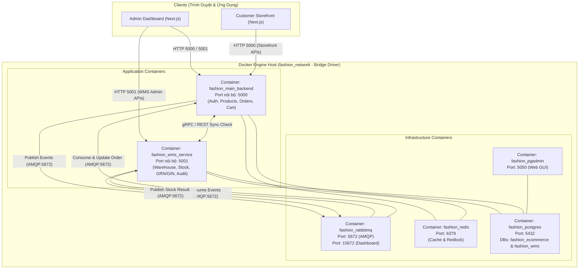
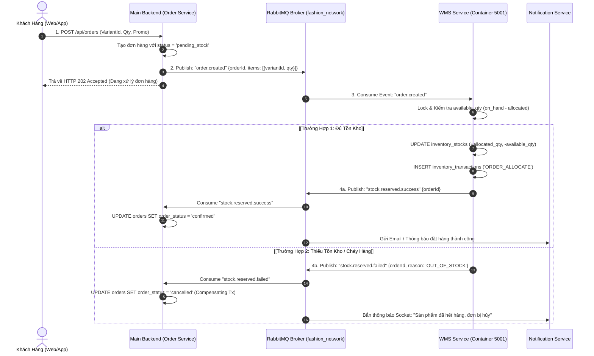
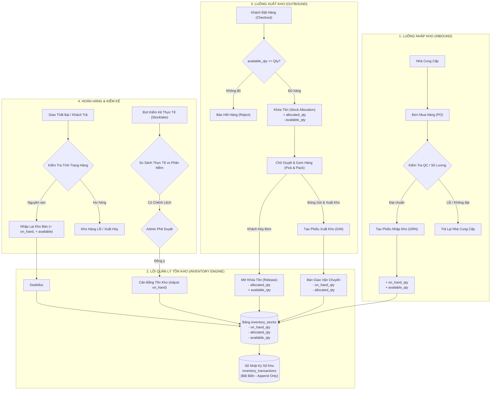
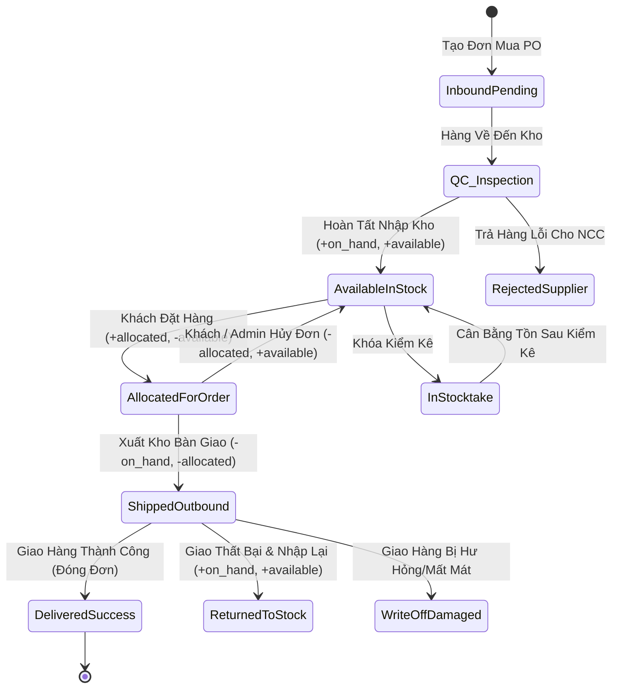
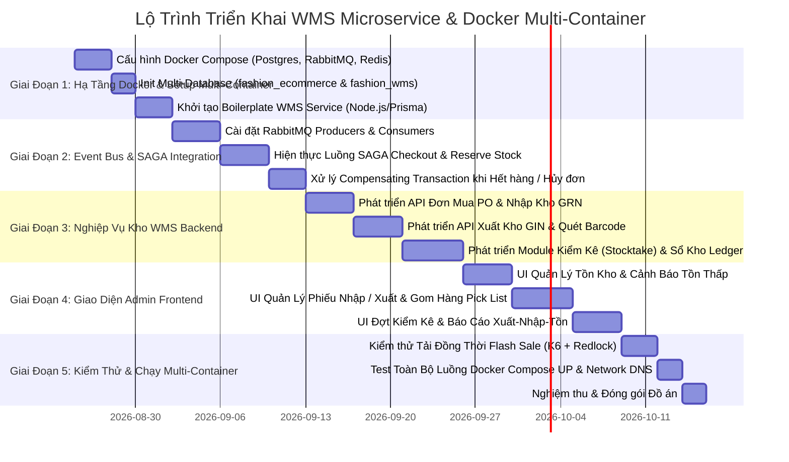

# TÀI LIỆU THIẾT KẾ QUY TRÌNH QUẢN LÝ KHO (WMS) & KIẾN TRÚC MICROSERVICES CONTAINER
**Hệ thống:** Fashion E-Commerce Platform (Admin Role)  
**Kiến trúc:** Microservices & Multi-Container Docker Architecture  
**Tác giả:** Antigravity Solution Architecture Team  
**Phiên bản:** 2.0 (Bản nâng cấp Microservices & Dockerized WMS)  
**Trạng thái:** Bản thiết kế hoàn chỉnh & Sẵn sàng triển khai  

---

## MỤC LỤC
1. [Tổng Quan & Mục Tiêu Hệ Thống](#1-tổng-quan--mục-tiêu-hệ-thống)
2. [Kiến Trúc Microservices & Phân Tách Container Docker](#2-kiến-trúc-microservices--phân-tách-container-docker)
   - [2.1. Phân định Service & Bounded Context](#21-phân-định-service--bounded-context)
   - [2.2. Sơ đồ Container Topology & Docker Network](#22-sơ-đồ-container-topology--docker-network)
   - [2.3. Thiết kế File `docker-compose.yml` Chuẩn Microservices](#23-thiết-kế-file-docker-composeyml-chuẩn-microservices)
   - [2.4. Cơ chế Kết nối & Giao tiếp Giữa các Container (Inter-Service Communication)](#24-cơ-chế-kết-nối--giao-tiếp-giữa-các-container-inter-service-communication)
3. [Giao Dịch Phân Tán & Đồng Bộ Tồn Kho (Distributed SAGA & Event Broker)](#3-giao-dịch-phân-tán--đồng-bộ-tồn-kho-distributed-saga--event-broker)
4. [Ma Trận Phân Quyền Vai Trò (RBAC)](#4-ma-trận-phân-quyền-vai-trò-rbac)
5. [Mô Hình Dữ Liệu Tồn Kho Nâng Cao (WMS Database Schema)](#5-mô-hình-dữ-liệu-tồn-kho-nâng-cao-wms-database-schema)
6. [Thiết Kế Toàn Bộ Các Flow Nghiệp Vụ Kho (Detailed Feature Flows)](#6-thiết-kế-toàn-bộ-các-flow-nghiệp-vụ-kho-detailed-feature-flows)
   - [6.1. Quy trình Nhập Kho (Inbound Management - GRN)](#61-quy-trình-nhập-kho-inbound-management---grn)
   - [6.2. Quy trình Xuất Kho Đơn Hàng & Vận Hành (Outbound Fulfillment - GIN)](#62-quy-trình-xuất-kho-đơn-hàng--vận-hành-outbound-fulfillment---gin)
   - [6.3. Quy trình Xử Lý Hàng Hoàn Trả & Hàng Boom (Returns & Reverse Logistics)](#63-quy-trình-xử-lý-hàng-hoàn-trả--hàng-boom-returns--reverse-logistics)
   - [6.4. Quy trình Kiểm Kê Kho & Cân Bằng Tồn (Stocktake & Adjustments)](#64-quy-trình-kiểm-kê-kho--cân-bằng-tồn-stocktake--adjustments)
   - [6.5. Quy trình Điều Chuyển & Xuất Hủy / Hao Hụt (Transfer & Write-off)](#65-quy-trình-điều-chuyển--xuất-hủy--hao-hụt-transfer--write-off)
7. [Sơ Đồ Luồng Nghiệp Vụ Hoàn Chỉnh (Mermaid Diagrams)](#7-sơ-đồ-luồng-nghiệp-vụ-hoàn-chỉnh-mermaid-diagrams)
8. [Xử Lý Các Kịch Bản Bất Thường & Rủi Ro (Edge Cases & Concurrency Control)](#8-xử-lý-các-kịch-bản-bất-thường--rủi-ro-edge-cases--concurrency-control)
9. [Đặc Tả Danh Mục API Cho Role Admin (RESTful Endpoints)](#9-đặc-tả-danh-mục-api-cho-role-admin-restful-endpoints)
10. [Hệ Thống Báo Cáo & Cảnh Báo Thông Minh (Reporting & Alerts)](#10-hệ-thống-báo-cáo--cảnh-báo-thông-minh-reporting--alerts)
11. [Kế Hoạch Triển Khai & Container Hóa Chi Tiết (Implementation Roadmap)](#11-kế-hoạch-triển-khai--container-hóa-chi-tiết-implementation-roadmap)

---

## 1. TỔNG QUAN & MỤC TIÊU HỆ THỐNG

### 1.1. Bối cảnh
Trong nền tảng E-commerce Thời trang, phân hệ Quản lý Kho (**Warehouse Management System - WMS**) là trái tim điều phối chuỗi cung ứng: từ nhập hàng nhà cung cấp, kiểm đếm chất lượng (QC), lưu kho theo vị trí kệ (`bin_location`), phân bổ tồn kho (`stock allocation`) cho đơn hàng trực tuyến, đến kiểm kê và xử lý hàng hoàn/boom.

Khi lưu lượng truy cập lớn (Flash Sale, Mega Campaign), việc tách WMS thành một **Microservice độc lập chạy trong Docker Container riêng** mang lại các lợi ích vượt trội:
- **Độc lập vận hành (Fault Isolation):** Sự cố tại phân hệ đơn hàng hoặc giỏ hàng không làm gián đoạn nghiệp vụ quét mã xuất/nhập tại kho vật lý.
- **Tối ưu hóa tài nguyên (Independent Scalability):** Dễ dàng scale riêng WMS Service hoặc Order Service khi có tải đột biến.
- **Codebase tinh gọn & Dễ bảo trì:** Tách biệt logic quản lý kho phức tạp ra khỏi khối Monolith ban đầu.

### 1.2. Nguyên tắc Quản lý Tồn kho 3 Lớp
- **`on_hand_qty` (Tồn vật lý):** Số lượng thực tế đang nằm trên kệ kho.
- **`allocated_qty` (Tồn giữ / Khóa đơn):** Số lượng hàng khách đã bấm đặt thành công, đang chờ gom hàng và đóng gói.
- **`available_qty` (Tồn khả dụng bán):** Số lượng thực tế khách có thể mua (`available_qty = on_hand_qty - allocated_qty`).
- **`inventory_transactions` (Sổ kho Bất biến / Stock Ledger):** Ghi nhận nhật ký toàn bộ mọi biến động tồn kho (Append-Only Audit Log).

---

## 2. KIẾN TRÚC MICROSERVICES & PHÂN TÁCH CONTAINER DOCKER

### 2.1. Phân định Service & Bounded Context

Hệ thống được tổ chức thành 2 cụm dịch vụ chính và hạ tầng hỗ trợ:
1. **Core E-Commerce Service (`main-backend` - Port 5000):**
   - Quản lý Auth, Users, Product Catalog, Promotions, Giỏ hàng, Đơn hàng (Orders) và Thanh toán (Payments).
2. **WMS & Inventory Microservice (`wms-service` - Port 5001):**
   - Quản lý Nhà kho (`warehouses`), Tồn kho 3 lớp (`inventory_stocks`), Đơn mua PO (`purchase_orders`), Phiếu nhập GRN, Phiếu xuất GIN, Kiểm kê kho (`stocktakes`) và Sổ kho (`inventory_transactions`).
3. **Message Broker (`rabbitmq` - Ports 5672, 15672):**
   - Đóng vai trò cầu nối Event Bus truyền tin bất đồng bộ giữa Main Service và WMS Service theo mô hình SAGA Pattern.
4. **Cơ sở dữ liệu (`postgres_db` - Port 5432):**
   - Sử dụng PostgreSQL đa Database (`fashion_ecommerce` cho Core và `fashion_wms` cho WMS) hoặc Multi-Schema trên cùng 1 instance Database Container.
5. **Caching & Distributed Lock (`redis` - Port 6379):**
   - Lưu trữ cache tồn kho khả dụng để đọc siêu tốc và thực hiện Distributed Locking khi Flash Sale.

---

### 2.2. Sơ đồ Container Topology & Docker Network



---

### 2.3. Thiết kế File `docker-compose.yml` Chuẩn Microservices

Dưới đây là cấu hình hoàn chỉnh cho file `docker-compose.yml` sẵn sàng khởi chạy toàn bộ hệ thống gồm DB, Message Queue, Redis và 2 dịch vụ Node.js Backend:

```yaml
version: '3.8'

networks:
  fashion_network:
    driver: bridge

volumes:
  postgres_data:
    driver: local
  rabbitmq_data:
    driver: local
  redis_data:
    driver: local

services:
  # 1. Database PostgreSQL
  postgres_db:
    image: postgres:16-alpine
    container_name: fashion_postgres
    restart: always
    environment:
      POSTGRES_USER: ${DB_USER:-postgres}
      POSTGRES_PASSWORD: ${DB_PASSWORD:-090103}
      POSTGRES_DB: ${DB_NAME:-fashion_ecommerce}
      POSTGRES_MULTIPLE_DATABASES: fashion_ecommerce,fashion_wms
    ports:
      - "${DB_PORT:-5432}:5432"
    volumes:
      - postgres_data:/var/lib/postgresql/data
      - ./scripts/init-multi-db.sh:/docker-entrypoint-initdb.d/init-multi-db.sh
    networks:
      - fashion_network

  # 2. Redis Caching & Lock Server
  redis:
    image: redis:7-alpine
    container_name: fashion_redis
    restart: always
    ports:
      - "6379:6379"
    volumes:
      - redis_data:/data
    networks:
      - fashion_network

  # 3. RabbitMQ Message Broker
  rabbitmq:
    image: rabbitmq:3-management-alpine
    container_name: fashion_rabbitmq
    restart: always
    environment:
      RABBITMQ_DEFAULT_USER: ${RABBITMQ_USER:-guest}
      RABBITMQ_DEFAULT_PASS: ${RABBITMQ_PASS:-guest}
    ports:
      - "5672:5672"     # AMQP Protocol
      - "15672:15672"   # Management Web UI
    volumes:
      - rabbitmq_data:/var/lib/rabbitmq
    networks:
      - fashion_network

  # 4. Main E-Commerce Backend Service (Orders, Auth, Products)
  main_backend:
    build:
      context: .
      dockerfile: Dockerfile
    container_name: fashion_main_backend
    restart: always
    environment:
      PORT: 5000
      DATABASE_URL: postgresql://${DB_USER:-postgres}:${DB_PASSWORD:-090103}@postgres_db:5432/${DB_NAME:-fashion_ecommerce}?schema=public
      RABBITMQ_URL: amqp://${RABBITMQ_USER:-guest}:${RABBITMQ_PASS:-guest}@rabbitmq:5672
      REDIS_URL: redis://redis:6379
      WMS_SERVICE_URL: http://wms_service:5001
      JWT_SECRET: ${JWT_SECRET:-secret_key}
    ports:
      - "5000:5000"
    depends_on:
      - postgres_db
      - rabbitmq
      - redis
    networks:
      - fashion_network

  # 5. WMS & Inventory Microservice
  wms_service:
    build:
      context: ./wms-service # Hoặc cùng repo với entrypoint riêng
      dockerfile: Dockerfile
    container_name: fashion_wms_service
    restart: always
    environment:
      PORT: 5001
      DATABASE_URL: postgresql://${DB_USER:-postgres}:${DB_PASSWORD:-090103}@postgres_db:5432/fashion_wms?schema=public
      RABBITMQ_URL: amqp://${RABBITMQ_USER:-guest}:${RABBITMQ_PASS:-guest}@rabbitmq:5672
      REDIS_URL: redis://redis:6379
      MAIN_BACKEND_URL: http://main_backend:5000
    ports:
      - "5001:5001"
    depends_on:
      - postgres_db
      - rabbitmq
      - redis
    networks:
      - fashion_network

  # 6. Database Admin UI (Optional)
  pgadmin:
    image: dpage/pgadmin4:latest
    container_name: fashion_pgadmin
    restart: always
    environment:
      PGADMIN_DEFAULT_EMAIL: admin@example.com
      PGADMIN_DEFAULT_PASSWORD: admin
    ports:
      - "5050:80"
    depends_on:
      - postgres_db
    networks:
      - fashion_network
```

---

### 2.4. Cơ chế Kết nối & Giao tiếp Giữa các Container

Khi các container nằm chung trong một `network` (ở đây là `fashion_network`), Docker Engine tự động kích hoạt tính năng **Embedded DNS Server**. 

#### 1. Giao tiếp qua Tên Container (Container Name / Service Name):
- `main_backend` kết nối Database bằng: `postgres_db:5432` (không dùng `localhost:5432`).
- `main_backend` gọi REST API đồng bộ sang WMS bằng: `http://wms_service:5001/api/v1/...`.
- Cả hai service kết nối RabbitMQ qua: `amqp://rabbitmq:5672`.
- Cả hai service kết nối Redis qua: `redis://redis:6379`.

#### 2. Chiến lược Giao Tiếp Hai Chế Độ (Hybrid Communication):
- **Đồng bộ (Synchronous - HTTP/REST / gRPC):** Sử dụng khi Frontend Admin cần tải bảng dữ liệu kho tức thì (Xem danh sách tồn, vị trí kệ, xem phiếu nhập/xuất).
- **Bất đồng bộ (Asynchronous - Event-Driven via RabbitMQ):** Sử dụng cho luồng đặt hàng và xuất kho để đảm bảo không bị nghẽn mạng (Non-blocking) và xử lý SAGA Transaction an toàn.

---

## 3. GIAO DỊCH PHÂN TÁN & ĐỒNG BỘ TỒN KHO (DISTRIBUTED SAGA)

### 3.1. Sơ Đồ Trình Tự SAGA Choreography Khi Khách Đặt Hàng



---

## 4. MA TRẬN PHÂN QUYỀN VAI TRÒ (RBAC)

| Chức năng nghiệp vụ | Super Admin | Quản lý kho (Warehouse Manager) | Thủ kho / Nhân viên kho (Warehouse Staff) | Nhân viên Mua hàng (Purchaser) | Kế toán / Kiểm toán (Auditor) |
| :--- | :---: | :---: | :---: | :---: | :---: |
| **Cấu hình Kho & Vị trí Kệ** | Toàn quyền | Xem & Cập nhật | Chỉ xem | Không | Chỉ xem |
| **Tạo Đơn mua hàng (PO)** | Toàn quyền | Tạo & Xem | Không | Tạo & Chỉnh sửa | Chỉ xem |
| **Duyệt Đơn mua hàng (PO)** | Toàn quyền | Duyệt (trong hạn mức) | Không | Không | Phê duyệt ngân sách |
| **Tạo Phiếu Nhập Kho (GRN)** | Toàn quyền | Toàn quyền | Tạo nháp & Đếm hàng | Tạo nháp | Chỉ xem |
| **Duyệt / Hoàn tất Nhập Kho** | Toàn quyền | Phê duyệt | Không | Không | Chỉ xem |
| **Tạo & In Pick List / Packing** | Toàn quyền | Toàn quyền | Thực hiện | Không | Không |
| **Xác nhận Xuất Kho (GIN)** | Toàn quyền | Phê duyệt | Quét mã xuất kho | Không | Chỉ xem |
| **Tạo Đợt Kiểm Kê (Stocktake)** | Toàn quyền | Khởi tạo & Phân công | Nhập số liệu đếm | Không | Đồng kiểm kê |
| **Duyệt Cân Bằng Kho (Adjustment)**| Toàn quyền | Duyệt lệch nhỏ | Không | Không | Đồng phê duyệt |
| **Xem Sổ Kho & Báo Cáo Tài Chính** | Toàn quyền | Báo cáo vận hành | Không | Báo cáo nhập hàng | Báo cáo chi tiết |

---

## 5. MÔ HÌNH DỮ LIỆU TỒN KHO NÂNG CAO (WMS DATABASE SCHEMA)

Mô hình dữ liệu này thuộc quản lý của **WMS Microservice Database (`fashion_wms`)**:

```prisma
// 1. Danh mục Kho hàng / Chi nhánh
model warehouses {
  id              String             @id @default(dbgenerated("gen_random_uuid()")) @db.Uuid
  code            String             @unique @db.VarChar(50) // VD: KHO-TONG-HN, KHO-HCM-01
  name            String             @db.VarChar(150)
  address         String?            @db.Text
  phone           String?            @db.VarChar(20)
  is_active       Boolean            @default(true)
  is_default      Boolean            @default(false)
  created_at      DateTime?          @default(now()) @db.Timestamp(6)
  updated_at      DateTime?          @default(now()) @db.Timestamp(6)

  inventory_stocks       inventory_stocks[]
  goods_receipt_notes    goods_receipt_notes[]
  goods_issue_notes      goods_issue_notes[]
  stock_transfers_from   stock_transfers[] @relation("WarehouseFrom")
  stock_transfers_to     stock_transfers[] @relation("WarehouseTo")
  stocktakes             stocktakes[]
  inventory_transactions inventory_transactions[]
}

// 2. Tồn kho biến thể theo từng kho (Stock Matrix)
model inventory_stocks {
  id              String            @id @default(dbgenerated("gen_random_uuid()")) @db.Uuid
  warehouse_id    String            @db.Uuid
  variant_id      String            @db.Uuid // Tham chiếu logic sang Product Service
  on_hand_qty     Int               @default(0) // Tồn vật lý thực tế trên kệ
  allocated_qty   Int               @default(0) // Tồn đang giữ cho đơn hàng chờ xuất
  available_qty   Int               @default(0) // on_hand_qty - allocated_qty
  min_alert_qty   Int               @default(5) // Ngưỡng cảnh báo sắp hết
  max_alert_qty   Int?              // Ngưỡng cảnh báo thừa hàng
  bin_location    String?           @db.VarChar(50) // Vị trí kệ: Kệ A-01-03
  updated_at      DateTime?         @default(now()) @db.Timestamp(6)

  warehouse       warehouses        @relation(fields: [warehouse_id], references: [id], onDelete: Cascade)

  @@unique([warehouse_id, variant_id], map: "uq_warehouse_variant_stock")
  @@index([variant_id], map: "idx_inventory_stocks_variant")
  @@index([available_qty], map: "idx_inventory_stocks_available")
}

// 3. Đơn đặt hàng Nhà Cung Cấp (Purchase Orders - PO)
model purchase_orders {
  id              String             @id @default(dbgenerated("gen_random_uuid()")) @db.Uuid
  code            String             @unique @db.VarChar(50) // VD: PO-20260820-001
  supplier_id     String             @db.Uuid
  warehouse_id    String             @db.Uuid
  status          String             @default("draft") @db.VarChar(30) // draft, approved, receiving, completed, cancelled
  total_amount    Decimal            @default(0) @db.Decimal(14, 2)
  expected_date   DateTime?          @db.Date
  notes           String?            @db.Text
  created_by      String             @db.Uuid
  approved_by     String?            @db.Uuid
  created_at      DateTime?          @default(now()) @db.Timestamp(6)
  updated_at      DateTime?          @default(now()) @db.Timestamp(6)

  items           purchase_order_items[]
  receipt_notes   goods_receipt_notes[]
}

model purchase_order_items {
  id              String             @id @default(dbgenerated("gen_random_uuid()")) @db.Uuid
  po_id           String             @db.Uuid
  variant_id      String             @db.Uuid
  ordered_qty     Int
  received_qty    Int                @default(0)
  unit_cost       Decimal            @db.Decimal(12, 2)
  total_cost      Decimal            @db.Decimal(14, 2)

  purchase_order  purchase_orders    @relation(fields: [po_id], references: [id], onDelete: Cascade)
}

// 4. Phiếu Nhập Kho (Goods Receipt Note - GRN)
model goods_receipt_notes {
  id              String             @id @default(dbgenerated("gen_random_uuid()")) @db.Uuid
  code            String             @unique @db.VarChar(50) // VD: GRN-20260820-001
  po_id           String?            @db.Uuid
  warehouse_id    String             @db.Uuid
  supplier_id     String?            @db.Uuid
  receipt_type    String             @db.VarChar(30) // po_import, return_import, transfer_import, other
  status          String             @default("draft") @db.VarChar(30) // draft, qc_pending, completed, cancelled
  total_qty       Int                @default(0)
  total_value     Decimal            @default(0) @db.Decimal(14, 2)
  notes           String?            @db.Text
  created_by      String             @db.Uuid
  confirmed_by    String?            @db.Uuid
  received_at     DateTime?          @db.Timestamp(6)
  created_at      DateTime?          @default(now()) @db.Timestamp(6)

  warehouse       warehouses         @relation(fields: [warehouse_id], references: [id], onDelete: Restrict)
  purchase_order  purchase_orders?   @relation(fields: [po_id], references: [id], onDelete: SetNull)
  items           goods_receipt_items[]
}

model goods_receipt_items {
  id              String             @id @default(dbgenerated("gen_random_uuid()")) @db.Uuid
  receipt_id      String             @db.Uuid
  variant_id      String             @db.Uuid
  quantity        Int
  unit_cost       Decimal            @db.Decimal(12, 2)
  total_cost      Decimal            @db.Decimal(14, 2)
  batch_number    String?            @db.VarChar(50)

  receipt_note    goods_receipt_notes @relation(fields: [receipt_id], references: [id], onDelete: Cascade)
}

// 5. Phiếu Xuất Kho (Goods Issue Note - GIN)
model goods_issue_notes {
  id              String             @id @default(dbgenerated("gen_random_uuid()")) @db.Uuid
  code            String             @unique @db.VarChar(50) // VD: GIN-20260820-001
  order_id        String?            @db.Uuid
  warehouse_id    String             @db.Uuid
  issue_type      String             @db.VarChar(30) // order_fulfillment, supplier_return, damaged_write_off, transfer_export
  status          String             @default("draft") @db.VarChar(30) // draft, picking, packed, shipped, cancelled
  total_qty       Int                @default(0)
  carrier_code    String?            @db.VarChar(50)
  tracking_number String?            @db.VarChar(100)
  notes           String?            @db.Text
  created_by      String             @db.Uuid
  shipped_by      String?            @db.Uuid
  shipped_at      DateTime?          @db.Timestamp(6)
  created_at      DateTime?          @default(now()) @db.Timestamp(6)

  warehouse       warehouses         @relation(fields: [warehouse_id], references: [id], onDelete: Restrict)
  items           goods_issue_items[]
}

model goods_issue_items {
  id              String             @id @default(dbgenerated("gen_random_uuid()")) @db.Uuid
  issue_id        String             @db.Uuid
  variant_id      String             @db.Uuid
  quantity        Int
  unit_price      Decimal            @db.Decimal(12, 2)

  issue_note      goods_issue_notes  @relation(fields: [issue_id], references: [id], onDelete: Cascade)
}

// 6. Phiếu Điều Chuyển Kho (Stock Transfers)
model stock_transfers {
  id                String           @id @default(dbgenerated("gen_random_uuid()")) @db.Uuid
  code              String           @unique @db.VarChar(50) // VD: ST-20260820-001
  from_warehouse_id String           @db.Uuid
  to_warehouse_id   String           @db.Uuid
  status            String           @default("pending") @db.VarChar(30) // pending, in_transit, completed, cancelled
  total_qty         Int              @default(0)
  notes             String?          @db.Text
  created_by        String           @db.Uuid
  approved_by       String?          @db.Uuid
  created_at        DateTime?        @default(now()) @db.Timestamp(6)
  completed_at      DateTime?        @db.Timestamp(6)

  from_warehouse    warehouses       @relation("WarehouseFrom", fields: [from_warehouse_id], references: [id], onDelete: Restrict)
  to_warehouse      warehouses       @relation("WarehouseTo", fields: [to_warehouse_id], references: [id], onDelete: Restrict)
  items             stock_transfer_items[]
}

model stock_transfer_items {
  id              String             @id @default(dbgenerated("gen_random_uuid()")) @db.Uuid
  transfer_id     String             @db.Uuid
  variant_id      String             @db.Uuid
  quantity        Int

  transfer        stock_transfers    @relation(fields: [transfer_id], references: [id], onDelete: Cascade)
}

// 7. Phiếu Kiểm Kê Kho (Stocktake / Inventory Audit)
model stocktakes {
  id              String             @id @default(dbgenerated("gen_random_uuid()")) @db.Uuid
  code            String             @unique @db.VarChar(50) // VD: STK-20260820-001
  warehouse_id    String             @db.Uuid
  status          String             @default("in_progress") @db.VarChar(30) // draft, in_progress, completed, cancelled
  total_system_qty Int               @default(0)
  total_actual_qty Int               @default(0)
  total_diff_qty   Int               @default(0)
  notes           String?            @db.Text
  created_by      String             @db.Uuid
  approved_by     String?            @db.Uuid
  created_at      DateTime?          @default(now()) @db.Timestamp(6)
  completed_at    DateTime?          @db.Timestamp(6)

  warehouse       warehouses         @relation(fields: [warehouse_id], references: [id], onDelete: Restrict)
  items           stocktake_items[]
}

model stocktake_items {
  id              String             @id @default(dbgenerated("gen_random_uuid()")) @db.Uuid
  stocktake_id    String             @db.Uuid
  variant_id      String             @db.Uuid
  system_qty      Int
  actual_qty      Int
  diff_qty        Int                // actual_qty - system_qty (dương = thừa, âm = thiếu)
  reason          String?            @db.VarChar(200)

  stocktake       stocktakes         @relation(fields: [stocktake_id], references: [id], onDelete: Cascade)
}

// 8. Sổ Nhật Ký Giao Dịch Tồn Kho (Immutable Stock Ledger)
model inventory_transactions {
  id              String             @id @default(dbgenerated("gen_random_uuid()")) @db.Uuid
  warehouse_id    String             @db.Uuid
  variant_id      String             @db.Uuid
  trans_type      String             @db.VarChar(40) 
  // 'ORDER_ALLOCATE', 'ORDER_RELEASE', 'ORDER_FULFILLMENT', 
  // 'PURCHASE_RECEIPT', 'PURCHASE_RETURN', 'CUSTOMER_RETURN', 
  // 'STOCKTAKE_ADJUST', 'TRANSFER_OUT', 'TRANSFER_IN', 'WRITE_OFF'
  
  change_on_hand  Int                @default(0)
  change_allocated Int               @default(0)
  change_available Int               @default(0)
  
  balance_on_hand   Int
  balance_allocated Int
  balance_available Int
  
  ref_type        String             @db.VarChar(50)
  ref_id          String             @db.Uuid
  ref_code        String?            @db.VarChar(50)
  notes           String?            @db.Text
  created_by      String?            @db.Uuid
  created_at      DateTime?          @default(now()) @db.Timestamp(6)

  warehouse       warehouses         @relation(fields: [warehouse_id], references: [id], onDelete: Restrict)

  @@index([warehouse_id, variant_id, created_at], map: "idx_inv_trans_lookup")
  @@index([ref_type, ref_id], map: "idx_inv_trans_ref")
}
```

---

## 6. THIẾT KẾ TOÀN BỘ CÁC FLOW NGHIỆP VỤ KHO (DETAILED FEATURE FLOWS)

### 6.1. Quy trình Nhập Kho (Inbound Management - GRN)
- **Tạo Đơn Mua PO:** Nhân viên mua hàng chọn nhà cung cấp, danh sách biến thể sản phẩm, đơn giá, ngày hàng về dự kiến.
- **QC & Kiểm đếm:** Khi hàng tới kho, thủ kho dùng máy quét Barcode quét đếm số lượng, kiểm tra lỗi nhãn mác, chất lượng vải.
- **Tạo Phiếu Nhập GRN:** Tách rõ hàng đạt chuẩn (Pass QC) và hàng lỗi (Fail QC).
- **Hoàn tất Nhập kho:** Hệ thống tự động `+on_hand_qty` và `+available_qty`, ghi nhận sổ kho `PURCHASE_RECEIPT`.

---

### 6.2. Quy trình Xuất Kho Đơn Hàng & Vận Hành (Outbound Fulfillment - GIN)
- **Khóa Tồn Tự Động (Stock Reservation):** Khi đơn hàng tạo thành công qua Event Bus SAGA, WMS tự động `+allocated_qty` và `-available_qty`.
- **In Pick List & Gom Hàng:** Nhân viên lấy danh sách sản phẩm theo từng vị trí kệ (`bin_location`).
- **Đóng Gói & Quét Barcode:** Quét mã vạch trên áo/quần để kiểm tra chéo với đơn hàng, in phiếu đóng gói.
- **Xuất Kho Bàn Giao ĐVVC:** Khi shipper nhận hàng, quét mã vận đơn để xuất kho: `-on_hand_qty`, `-allocated_qty`, ghi sổ kho `ORDER_FULFILLMENT`.

---

### 6.3. Quy trình Xử Lý Hàng Hoàn Trả & Hàng Boom (Returns & Reverse Logistics)
- **Hủy trước khi xuất kho:** Trả lại tồn bán ngay: `-allocated_qty`, `+available_qty`, ghi sổ kho `ORDER_RELEASE`.
- **Hàng giao không thành công (Boom hàng):** ĐVVC hoàn hàng về kho -> Thủ kho kiểm tra tình trạng:
  - Nếu nguyên vẹn: Tạo phiếu nhập lại `CUSTOMER_RETURN` (`+on_hand_qty`, `+available_qty`).
  - Nếu bị rách/dơ: Chuyển sang khu vực hàng lỗi hoặc tạo phiếu xuất hủy `WRITE_OFF`.

---

### 6.4. Quy trình Kiểm Kê Kho & Cân Bằng Tồn (Stocktake & Adjustments)
- Khởi tạo đợt kiểm kê theo toàn kho hoặc theo danh mục -> Snapshot số lượng hệ thống `system_qty`.
- Nhân viên quét mã Barcode đếm thực tế `actual_qty`.
- Tính độ lệch `diff_qty = actual_qty - system_qty`. Phân loại Thừa/Thiếu/Khớp.
- Nhập lý do giải trình -> Admin/Kế toán phê duyệt cân bằng kho: Cập nhật `on_hand_qty = actual_qty` và ghi sổ kho `STOCKTAKE_ADJUST`.

---

### 6.5. Quy trình Điều Chuyển & Xuất Hủy / Hao Hụt (Transfer & Write-off)
- **Điều chuyển (Transfer):** Kho A tạo phiếu xuất chuyển `TRANSFER_OUT` (hàng chuyển sang trạng thái `in_transit`) -> Kho B nhận hàng kiểm đếm và bấm nhập `TRANSFER_IN`.
- **Xuất hủy (Write-off):** Xuất hủy hàng lỗi mốt, hỏng nặng, rách vải kèm biên bản hình ảnh -> Trừ tồn và ghi nhận chi phí hao hụt.

---

## 7. SƠ ĐỒ LUỒNG NGHIỆP VỤ HOÀN CHỈNH (MERMAID DIAGRAMS)

### 7.1. Sơ Đồ Kiến Trúc Luồng Dữ Liệu Tồn Kho WMS



---

### 7.2. Sơ Đồ State Machine: Vòng Đời Tồn Kho Biến Thể Sản Phẩm



---

## 8. XỬ LÝ CÁC KỊCH BẢN BẤT THƯỜNG & RỦI RO (EDGE CASES)

### 8.1. Chống Overselling Khi Flash Sale Với Distributed Lock (Redlock)
- Khi có hàng nghìn lượt mua đồng thời, WMS Service áp dụng **Redis Distributed Lock (Redlock)** theo key `lock:variant:{variantId}` kết hợp với SQL Atomic Update:
  ```sql
  UPDATE inventory_stocks
  SET allocated_qty = allocated_qty + $qty,
      available_qty = available_qty - $qty,
      updated_at = NOW()
  WHERE warehouse_id = $warehouse_id 
    AND variant_id = $variant_id 
    AND (on_hand_qty - allocated_qty) >= $qty;
  ```
- Nếu `rowCount == 0`, trả về lỗi tức thì, không bao giờ xảy ra âm kho.

### 8.2. Đảm Bảo Tính Bất Biến & Chống Mất Mát Event (Outbox Pattern & Idempotency)
- **Idempotency Key:** Mỗi event từ RabbitMQ đều đi kèm `eventId` (UUID). WMS Service lưu `processed_events` để đảm bảo nếu RabbitMQ gửi trùng event thì WMS cũng không bị trừ/khóa tồn kho 2 lần.
- **Transactional Outbox Pattern:** Khi Order Service tạo đơn, event được ghi cùng transaction SQL vào bảng `outbox_events` trước khi gửi sang RabbitMQ để đảm bảo không bị mất event khi restart container.

---

## 9. ĐẶC TẢ DANH MỤC API CHO ROLE ADMIN (RESTFUL ENDPOINTS)

### 9.1. Nhóm Quản Lý Kho & Tồn Kho (Warehouse & Stocks)
- `GET /api/admin/warehouses` : Danh sách tất cả các kho hàng.
- `POST /api/admin/warehouses` : Tạo mới kho hàng.
- `GET /api/admin/inventory/stocks` : Danh sách tồn kho theo từng biến thể (filter: kho, danh mục, search SKU, cảnh báo tồn thấp `is_low_stock=true`).
- `GET /api/admin/inventory/stocks/:variantId` : Chi tiết tồn kho 3 lớp và vị trí kệ của biến thể.
- `PUT /api/admin/inventory/stocks/:variantId/thresholds` : Cài đặt ngưỡng cảnh báo tồn tối thiểu / tối đa.
- `GET /api/admin/inventory/transactions` : Xem sổ nhật ký biến động kho (Audit Ledger) có phân trang và bộ lọc nâng cao.

### 9.2. Nhóm Đơn Mua & Nhập Kho (Purchase Orders & GRN)
- `GET /api/admin/inventory/purchase-orders` : Danh sách đơn đặt hàng nhà cung cấp.
- `POST /api/admin/inventory/purchase-orders` : Tạo đơn mua hàng PO mới.
- `PUT /api/admin/inventory/purchase-orders/:id/approve` : Phê duyệt đơn mua hàng.
- `POST /api/admin/inventory/goods-receipt` : Tạo và xác nhận phiếu nhập kho (GRN).
- `GET /api/admin/inventory/goods-receipt/:id` : Chi tiết phiếu nhập kho và lịch sử lô hàng.

### 9.3. Nhóm Xuất Kho & Hoàn Hàng (Goods Issue & Returns)
- `GET /api/admin/inventory/goods-issue` : Danh sách phiếu xuất kho.
- `POST /api/admin/inventory/goods-issue` : Tạo phiếu xuất kho (cho đơn hàng hoặc xuất khác).
- `POST /api/admin/inventory/goods-issue/bulk-ship` : Quét mã vạch xuất kho hàng loạt đơn hàng.
- `POST /api/admin/inventory/returns/receive` : Tiếp nhận kiện hàng hoàn, kiểm tra QC và nhập lại kho bán.

### 9.4. Nhóm Kiểm Kê & Cân Bằng Kho (Stocktake & Adjustments)
- `GET /api/admin/inventory/stocktakes` : Danh sách các đợt kiểm kê kho.
- `POST /api/admin/inventory/stocktakes` : Khởi tạo đợt kiểm kê kho mới.
- `PUT /api/admin/inventory/stocktakes/:id/items` : Cập nhật số lượng đếm thực tế của các mã SKU.
- `POST /api/admin/inventory/stocktakes/:id/complete-and-adjust` : Phê duyệt biên bản kiểm kê và tự động cân bằng tồn kho.

---

## 10. HỆ THỐNG BÁO CÁO & CẢNH BÁO THÔNG MINH (REPORTING & ALERTS)

1. **Báo Cáo Xuất - Nhập - Tồn Toàn Diện (Stock Movement Summary):**
   - `Tồn cuối kỳ = Tồn đầu kỳ + Tổng Nhập - Tổng Xuất +/- Điều chỉnh kiểm kê`.
2. **Báo Cáo Định Giá Tồn Kho (Inventory Valuation):**
   - Tính tổng giá trị vốn đang đọng trong kho theo phương pháp Bình quân gia quyền (Weighted Average Cost) hoặc FIFO.
3. **Báo Cáo Hàng Chậm Luân Chuyển / Hàng Tồn Đọng (Slow-Moving & Dead Stock):**
   - Nhận diện các mẫu quần áo không phát sinh đơn hàng trong 30 / 60 / 90 ngày.
4. **Hệ Thống Cảnh Báo Tự Động (Automated Alerts):**
   - Cảnh báo sắp hết hàng (Low Stock), cảnh báo cháy hàng (Out of Stock), cảnh báo chênh lệch lớn khi kiểm kê.

---

## 11. KẾ HOẠCH TRIỂN KHAI & CONTAINER HÓA CHI TIẾT (IMPLEMENTATION ROADMAP)



### Kế Hoạch 5 Bước Cụ Thể Để Chạy Hệ Thống Multi-Container:
1. **Bước 1:** Tạo thư mục riêng cho WMS service (ví dụ `wms-service/` hoặc tách service trong cùng monorepo) kèm file `Dockerfile` riêng.
2. **Bước 2:** Cập nhật file `docker-compose.yml` định nghĩa các container `main_backend`, `wms_service`, `postgres_db`, `rabbitmq`, `redis` chung `fashion_network`.
3. **Bước 3:** Sử dụng script khởi tạo tự động 2 database (`fashion_ecommerce` và `fashion_wms`) khi `postgres_db` khởi động lần đầu.
4. **Bước 4:** Cấu hình biến môi trường kết nối qua DNS nội bộ Docker (`http://wms_service:5001`, `amqp://rabbitmq:5672`, `postgres_db:5432`).
5. **Bước 5:** Chạy lệnh `docker compose up -d --build` để khởi động toàn bộ cụm dịch vụ chỉ với một câu lệnh duy nhất.
