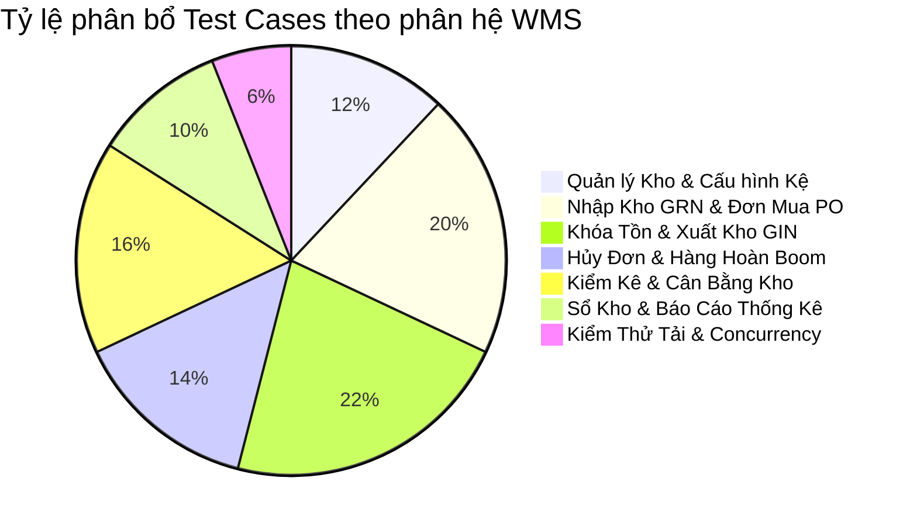

# BỘ TEST CASES & KỊCH BẢN KIỂM THỬ QUẢN LÝ KHO (WMS) - ADMIN ROLE
**Dự án:** Fashion E-Commerce Platform  
**Phân hệ:** Quản lý Kho & Xuất Nhập Tồn (WMS Microservice)  
**Tài liệu:** Bảng Đặc Tả Test Cases & Kịch Bản Kiểm Thử Giao Diện / API  
**Phiên bản:** 1.0  
**Ngày lập:** 20/08/2026  

---

## MỤC LỤC
1. [Tổng Quan & Ma Trận Phủ Test Cases](#1-tổng-quan--ma-trận-phủ-test-cases)
2. [Bộ Test Cases Chi Tiết Theo Phân Hệ (Detailed Test Cases)](#2-bộ-test-cases-chi-tiết-theo-phân-hệ)
   - [Nhóm 1: Quản lý Kho & Thiết lập Tồn Kho (Warehouse & Stocks Configuration)](#nhóm-1-quản-lý-kho--thiết-lập-tồn-kho)
   - [Nhóm 2: Quy trình Đơn Mua Hàng & Nhập Kho NCC (Purchase Orders & Goods Receipt - GRN)](#nhóm-2-quy-trình-đơn-mua-hàng--nhập-kho-ncc)
   - [Nhóm 3: Quy trình Đặt Hàng TMĐT & Xuất Kho Giao Hàng (Order Allocation & Goods Issue - GIN)](#nhóm-3-quy-trình-đặt-hàng-tmđt--xuất-kho-giao-hàng)
   - [Nhóm 4: Quy trình Xử Lý Hủy Đơn & Hàng Hoàn / Boom Hàng (Cancellations & Returns)](#nhóm-4-quy-trình-xử-lý-hủy-đơn--hàng-hoàn--boom-hàng)
   - [Nhóm 5: Quy trình Kiểm Kê & Cân Bằng Tồn Kho (Stocktake & Adjustments)](#nhóm-5-quy-trình-kiểm-kê--cân-bằng-tồn-kho)
   - [Nhóm 6: Sổ Kho Nhật Ký Bất Biến & Báo Cáo Thống Kê (Audit Ledger & Analytics)](#nhóm-6-sổ-kho-nhật-ký-bất-biến--báo-cáo-thống-kê)
   - [Nhóm 7: Kiểm Thử Đồng Thời & Biên Flash Sale (Concurrency & Edge Cases)](#nhóm-7-kiểm-thử-đồng-thời--biên-flash-sale)
3. [Hướng Dẫn Thực Hiện Test Trên Giao Diện & API](#3-hướng-dẫn-thực-hiện-test-trên-giao-diện--api)

---

## 1. TỔNG QUAN & MA TRẬN PHỦ TEST CASES

---

## 2. BỘ TEST CASES CHI TIẾT THEO PHÂN HỆ

### NHÓM 1: QUẢN LÝ KHO & THIẾT LẬP TỒN KHO

| Test ID | Tên Kịch Bản / Chức Năng | Tiền Điều Kiện | Các Bước Thực Hiện (Test Steps) | Dữ Liệu Đầu Vào (Test Data) | Kết Quả Kỳ Vọng (Expected Results) | Mức Độ |
| :--- | :--- | :--- | :--- | :--- | :--- | :---: |
| **TC-WMS-01** | Tạo mới kho hàng thành công | Đã đăng nhập Admin | 1. Vào trang Quản lý Kho. 2. Bấm "Thêm kho mới". 3. Nhập đầy đủ thông tin. 4. Bấm "Lưu". | Mã kho: `KHO-HCM-01` Tên: `Kho Chi Nhánh HCM` Địa chỉ: `Quận 1, TP.HCM` SĐT: `0988123456` | - Tạo kho thành công (HTTP 201). - Danh sách kho hiển thị dòng mới. - Trạng thái kho là `Đang hoạt động`. | **High** |
| **TC-WMS-02** | Báo lỗi khi tạo mã kho trùng lặp | Đã có kho `KHO-HCM-01` | 1. Bấm "Thêm kho mới". 2. Nhập mã kho đã tồn tại. 3. Bấm "Lưu". | Mã kho: `KHO-HCM-01` | - Hệ thống báo lỗi: `"Mã kho KHO-HCM-01 đã tồn tại"`. - Không tạo bản ghi trùng trong DB. | **Medium** |
| **TC-WMS-03** | Cấu hình vị trí kệ & Ngưỡng tồn an toàn | Đã có sản phẩm trong kho | 1. Vào danh sách Tồn kho. 2. Chọn biến thể `SM-TRANG-M`. 3. Nhập vị trí kệ và ngưỡng tồn. 4. Bấm "Cập nhật". | Vị trí: `Kệ A-02-01` Min Alert: `10` Max Alert: `200` | - Cập nhật thành công. - Khi tồn khả dụng `<= 10`, hệ thống gắn cờ cảnh báo `is_low_stock = true`. | **High** |
| **TC-WMS-04** | Bộ lọc tìm kiếm tồn kho theo trạng thái | Đã có dữ liệu tồn kho | 1. Vào trang Tồn kho. 2. Chọn bộ lọc: "Sắp hết hàng" hoặc "Hết hàng". | Filter: `is_low_stock = true` | - Bảng chỉ hiển thị các mặt hàng có `available_qty <= min_alert_qty`. | **Medium** |

---

### NHÓM 2: QUY TRÌNH ĐƠN MUA HÀNG & NHẬP KHO NCC

| Test ID | Tên Kịch Bản / Chức Năng | Tiền Điều Kiện | Các Bước Thực Hiện (Test Steps) | Dữ Liệu Đầu Vào (Test Data) | Kết Quả Kỳ Vọng (Expected Results) | Mức Độ |
| :--- | :--- | :--- | :--- | :--- | :--- | :---: |
| **TC-WMS-05** | Tạo Đơn Mua Hàng (PO) Mới | Đã có Nhà cung cấp và Biến thể SP | 1. Vào mục Đơn mua hàng PO. 2. Bấm "Tạo PO mới". 3. Chọn NCC, Kho nhận, danh sách SP và số lượng đặt. 4. Bấm "Lưu nháp". | NCC: `May Mặc Việt Tiến` SP 1: `Áo Polo Đen M` (50 cái, giá 120k) SP 2: `Quần Kaki 32` (30 cái, giá 200k) | - Tạo thành công mã `PO-YYYYMMDD-XXXX`. - Trạng thái PO: `draft`. - Tổng tiền: `12.000.000đ`. - Tồn kho chưa thay đổi. | **High** |
| **TC-WMS-06** | Phê duyệt Đơn Mua Hàng PO | Đơn PO ở trạng thái `draft` | 1. Mở chi tiết PO. 2. Admin bấm "Phê duyệt đơn". | PO ID: `PO-20260820-001` | - Trạng thái PO chuyển thành `approved`. - Cho phép lập phiếu nhập kho theo đơn PO này. | **High** |
| **TC-WMS-07** | Nhập kho GRN theo Đơn PO (Đủ số lượng) | Đơn PO đã `approved` | 1. Bấm "Tạo phiếu nhập từ PO". 2. Kiểm đếm thực tế nhập đủ số lượng. 3. Bấm "Hoàn tất nhập kho". | Mã PO: `PO-20260820-001` Thực nhận: Đúng 50 áo Polo, 30 quần Kaki | - Tạo mã `GRN-YYYYMMDD-XXXX` (Status: `completed`). - `on_hand_qty` tăng đúng +50 và +30. - `available_qty` tăng đúng +50 và +30. - PO chuyển sang trạng thái `completed`. - Sổ kho ghi nhận 2 dòng `PURCHASE_RECEIPT`. | **Critical** |
| **TC-WMS-08** | Nhập kho GRN từng phần (Partial Delivery) | Đơn PO đặt 100 cái | 1. Xe giao đợt 1 chỉ có 40 cái. 2. Nhập 40 cái và bấm Hoàn tất. | Nhập đợt 1: 40 cái | - Tồn kho tăng +40 cái. - PO chuyển sang trạng thái `receiving` (đang nhận). - `received_qty = 40 / 100`. | **High** |
| **TC-WMS-09** | Nhập hàng hoàn trả từ khách (Customer Return) | Đơn hàng giao thất bại | 1. Chọn loại nhập: `return_import`. 2. Nhập mã đơn hàng cũ và số lượng hoàn. 3. Bấm "Nhập lại kho". | Đơn: `ORD-001` SP: `Áo Sơ Mi M` (1 cái) | - Tồn `on_hand_qty` và `available_qty` tăng +1. - Sổ kho ghi nhật ký `CUSTOMER_RETURN`. | **High** |

---

### NHÓM 3: QUY TRÌNH ĐẶT HÀNG TMĐT & XUẤT KHO GIAO HÀNG

| Test ID | Tên Kịch Bản / Chức Năng | Tiền Điều Kiện | Các Bước Thực Hiện (Test Steps) | Dữ Liệu Đầu Vào (Test Data) | Kết Quả Kỳ Vọng (Expected Results) | Mức Độ |
| :--- | :--- | :--- | :--- | :--- | :--- | :---: |
| **TC-WMS-10** | Tự động Khóa Tồn (Stock Allocation) khi khách Checkout | Áo sơ mi M có `on_hand=100`, `available=100` | 1. Khách hàng đặt mua 2 chiếc áo trên web store. 2. Đơn hàng tạo thành công (Pending). | Qty: `2 chiếc` Order: `ORD-20260820-001` | - `allocated_qty` tăng lên `2`. - `available_qty` giảm còn `98`. - `on_hand_qty` **giữ nguyên 100** (hàng vẫn còn trên kệ). - Sổ kho ghi nhận `ORDER_ALLOCATE`. | **Critical** |
| **TC-WMS-11** | Chặn đặt hàng khi Tồn Khả Dụng không đủ | Sản phẩm chỉ còn `available=1` | 1. Khách hàng chọn mua số lượng 2 chiếc. 2. Bấm nút "Đặt hàng". | Qty: `2 chiếc` | - Hệ thống từ chối đặt hàng. - Báo lỗi: `"Sản phẩm không đủ số lượng tồn kho khả dụng (còn 1)"`. | **Critical** |
| **TC-WMS-12** | In Phiếu Gom Hàng (Pick List) theo Vị Trí Kệ | Có 5 đơn hàng đang chờ đóng gói | 1. Admin vào Quản lý Đơn hàng. 2. Chọn 5 đơn -> Bấm "In Danh sách Gom hàng (Pick List)". | 5 đơn hàng | - Hệ thống in danh sách sắp xếp theo thứ tự vị trí kệ `bin_location` (Kệ A-01 -> Kệ A-02 -> Kệ B-01) giúp thủ kho đi gom hàng nhanh nhất. | **Medium** |
| **TC-WMS-13** | Quét Barcode đóng gói & Kiểm tra chéo đơn hàng | Đã gom hàng về bàn đóng gói | 1. Mở màn hình Đóng gói. 2. Quét mã vận đơn. 3. Quét mã Barcode từng sản phẩm. | Scan SKU: `SM-TRANG-M` | - Hệ thống tick xanh sản phẩm đúng. - Nếu quét nhầm áo Size S vào đơn Size M -> Báo còi cảnh báo `"Sai phân loại sản phẩm!"`. | **High** |
| **TC-WMS-14** | Tạo Phiếu Xuất Kho (GIN) & Bàn giao ĐVVC | Đơn hàng đã đóng gói xong | 1. Chọn đơn hàng cần xuất. 2. Nhập đơn vị vận chuyển & Mã tracking. 3. Bấm "Xác nhận xuất kho". | Carrier: `GHTK` Tracking: `GHTK123456789` SP: `2 áo sơ mi M` | - Tạo mã `GIN-YYYYMMDD-XXXX`. - `on_hand_qty` giảm từ 100 xuống `98`. - `allocated_qty` giảm từ 2 về `0`. - `available_qty` giữ nguyên `98`. - Sổ kho ghi nhận `ORDER_FULFILLMENT`. | **Critical** |
| **TC-WMS-15** | Xuất hủy hàng lỗi mốt / ố rách (Write-off) | Có 3 áo bị rách vải khi lưu kho | 1. Chọn loại xuất: `damaged_write_off`. 2. Nhập số lượng 3 và lý do. 3. Bấm "Xác nhận xuất hủy". | SP: `Áo Sơ Mi M` (3 cái) Lý do: `Rách đường may khi vận chuyển` | - `on_hand_qty` và `available_qty` giảm -3. - Sổ kho ghi nhận `WRITE_OFF`. - Cập nhật chi phí hao hụt vào báo cáo tài chính. | **High** |

---

### NHÓM 4: QUY TRÌNH XỬ LÝ HỦY ĐƠN & HÀNG HOÀN / BOOM HÀNG

| Test ID | Tên Kịch Bản / Chức Năng | Tiền Điều Kiện | Các Bước Thực Hiện (Test Steps) | Dữ Liệu Đầu Vào (Test Data) | Kết Quả Kỳ Vọng (Expected Results) | Mức Độ |
| :--- | :--- | :--- | :--- | :--- | :--- | :---: |
| **TC-WMS-16** | Hủy đơn hàng trước khi xuất kho | Đơn hàng đang ở trạng thái `pending` (đang giữ 2 cái) | 1. Khách hàng hoặc Admin bấm "Hủy đơn hàng". 2. Nhập lý do hủy. | Order: `ORD-001` (2 cái) | - Giải phóng tồn giữ: `allocated_qty = allocated_qty - 2`. - Phục hồi tồn bán: `available_qty = available_qty + 2`. - `on_hand_qty` không đổi. - Sổ kho ghi nhận `ORDER_RELEASE`. | **Critical** |
| **TC-WMS-17** | Hủy đơn hàng khi đã đóng gói xong (Packed) | Đơn hàng đã đóng gói nhưng chưa giao cho shipper | 1. Admin bấm Hủy đơn. 2. Màn hình kho hiện thông báo: "Yêu cầu rút đơn khỏi kiện hàng xuất". | Order: `ORD-002` | - Trả lại tồn bán `available_qty`. - Nhân viên mở gói hàng, trả áo về lại kệ `bin_location`. | **High** |
| **TC-WMS-18** | Xử lý Hàng Boom (Khách không nhận hàng) | Đơn hàng đã xuất kho `delivering` | 1. Shipper mang hàng trả về kho. 2. Nhân viên quét mã vận đơn trên gói hàng. 3. Kiểm tra tem mác còn nguyên vẹn. 4. Bấm "Nhập lại kho bán". | Tracking: `GHTK123456789` Tình trạng: `Nguyên vẹn 100%` | - Tự động tạo phiếu nhập hoàn `return_import`. - `on_hand_qty` và `available_qty` tăng +1. - Sổ kho ghi nhận `CUSTOMER_RETURN`. | **Critical** |
| **TC-WMS-19** | Xử lý Hàng Hoàn bị dơ bẩn / rách | Đơn hoàn về bị rách bao bì, áo bẩn | 1. Kiểm tra QC đánh giá: Hàng hỏng. 2. Chọn: "Chuyển vào Kho Hàng Lỗi / Chờ Xử Lý". | Tình trạng: `Hỏng, rách` | - Không nhập lại vào tồn khả dụng bán (`available_qty` không tăng). - Ghi nhận vào danh mục hàng tổn thất chờ thanh lý/sửa chữa. | **High** |

---

### NHÓM 5: QUY TRÌNH KIỂM KÊ & CÂN BẰNG TỒN KHO

| Test ID | Tên Kịch Bản / Chức Năng | Tiền Điều Kiện | Các Bước Thực Hiện (Test Steps) | Dữ Liệu Đầu Vào (Test Data) | Kết Quả Kỳ Vọng (Expected Results) | Mức Độ |
| :--- | :--- | :--- | :--- | :--- | :--- | :---: |
| **TC-WMS-20** | Khởi tạo Đợt Kiểm Kê Kho (Stocktake) | Kho có 100 sản phẩm các loại | 1. Vào menu "Kiểm kê kho". 2. Bấm "Tạo đợt kiểm kê mới". 3. Chọn kho cần kiểm kê. | Kho: `Kho Tổng Hà Nội` | - Tạo mã `STK-YYYYMMDD-XXXX`. - Hệ thống tự động **chụp nhanh (Snapshot)** toàn bộ số lượng tồn hệ thống (`system_qty`). - Trạng thái đợt kiểm kê: `in_progress`. | **High** |
| **TC-WMS-21** | Nhập số lượng đếm thực tế & Tính chênh lệch | Đợt kiểm kê đang `in_progress` | 1. Nhân viên cầm máy quét đếm hàng trên kệ. 2. Nhập số lượng thực tế đếm được (`actual_qty`). | Mã 1: System=50, Đếm được=52 (Thừa 2) Mã 2: System=30, Đếm được=28 (Thiếu 2) | - Hệ thống tự động tính `diff_qty`: Mã 1 lệch `+2`, Mã 2 lệch `-2`. - Bôi màu trực quan (Xanh = Thừa, Đỏ = Thiếu, Xám = Khớp). | **High** |
| **TC-WMS-22** | Nhập lý do giải trình chênh lệch | Có chênh lệch số lượng | 1. Nhân viên nhập lý do vào từng dòng lệch. | Lý do: `"Nhầm size M sang size L do gấp nhầm móc"` | - Lưu lý do giải trình vào biên bản kiểm kê. | **Medium** |
| **TC-WMS-23** | Phê duyệt & Tự động Cân Bằng Tồn Kho | Biên bản kiểm kê đã hoàn thành đếm | 1. Admin/Kế toán xem xét đối soát. 2. Bấm nút "Phê duyệt & Cân bằng tồn". | Stocktake ID: `STK-001` | - Trạng thái kiểm kê chuyển thành `completed`. - `on_hand_qty` được cập nhật chính xác bằng `actual_qty` thực tế. - Tự động tính lại `available_qty`. - Sổ kho ghi nhận giao dịch `STOCKTAKE_ADJUST` cho các mã có chênh lệch. | **Critical** |
| **TC-WMS-24** | Chặn chỉnh sửa sau khi Đợt Kiểm Kê đã hoàn tất | Đợt kiểm kê đã `completed` | 1. Mở đợt kiểm kê đã duyệt. 2. Cố tình sửa số lượng đếm. | Status: `completed` | - Toàn bộ ô nhập bị Disable (Read-only). - Không cho phép sửa đổi số liệu đã chốt sổ. | **Medium** |

---

### NHÓM 6: SỔ KHO NHẬT KÝ BẤT BIẾN & BÁO CÁO THỐNG KÊ

| Test ID | Tên Kịch Bản / Chức Năng | Tiền Điều Kiện | Các Bước Thực Hiện (Test Steps) | Dữ Liệu Đầu Vào (Test Data) | Kết Quả Kỳ Vọng (Expected Results) | Mức Độ |
| :--- | :--- | :--- | :--- | :--- | :--- | :---: |
| **TC-WMS-25** | Kiểm tra Tính Bất Biến của Sổ Kho (Audit Ledger) | Đã phát sinh nhiều giao dịch nhập/xuất | 1. Vào trang "Sổ Nhật Ký Giao Dịch Kho". 2. Xem chi tiết từng dòng. | Bảng `inventory_transactions` | - Mọi biến động đều có: Loại GD (`trans_type`), Số lượng thay đổi (`change_on_hand`, `change_allocated`), Số dư sau GD (`balance_on_hand`), Mã chứng từ tham chiếu (`ref_code`), Thời gian chính xác đến từng mili-giây. | **Critical** |
| **TC-WMS-26** | Tra cứu Lịch sử Biến Động theo Biến thể SP | Cần đối soát 1 mã áo cụ thể | 1. Chọn biến thể `SM-TRANG-M`. 2. Bấm "Xem lịch sử sổ kho". | Variant: `SM-TRANG-M` | - Hiển thị toàn bộ dòng đời của chiếc áo từ lúc Nhập NCC -> Khách đặt đơn -> Bàn giao shipper -> Trả hàng hoàn. | **High** |
| **TC-WMS-27** | Báo Cáo Xuất - Nhập - Tồn Toàn Diện | Chọn khoảng thời gian từ ngày A đến ngày B | 1. Vào menu Báo Cáo Kho. 2. Chọn khoảng ngày 01/08 - 31/08. 3. Bấm "Xuất báo cáo". | Date range: Tháng 8/2026 | - Báo cáo hiển thị công thức chuẩn: `Tồn đầu kỳ + Tổng Nhập - Tổng Xuất +/- Lệch Kiểm Kê = Tồn Cuối Kỳ`. - Số liệu khớp 100% với Sổ kho. | **High** |
| **TC-WMS-28** | Dashboard Cảnh Báo Tồn Kho Tức Thời | Có mặt hàng sắp hết và hết hàng | 1. Mở trang Dashboard WMS. | API `/api/v1/reports/summary` | - Thẻ Card thống kê trực quan: • Tổng tồn kho vật lý. • Số lượng đang khóa cho đơn. • Số mã sắp hết hàng (Low stock alert). • Số mã đã cháy hàng (Out of stock). | **High** |

---

### NHÓM 7: KIỂM THỬ ĐỒNG THỜI & BIÊN FLASH SALE

| Test ID | Tên Kịch Bản / Chức Năng | Tiền Điều Kiện | Các Bước Thực Hiện (Test Steps) | Dữ Liệu Đầu Vào (Test Data) | Kết Quả Kỳ Vọng (Expected Results) | Mức Độ |
| :--- | :--- | :--- | :--- | :--- | :--- | :---: |
| **TC-WMS-29** | Chống Bán Quá Số Lượng (Anti-Overselling Flash Sale) | Áo Flash Sale chỉ còn duy nhất `available = 1` | 1. Giả lập 50 requests đặt mua cùng 1 giây (dùng công cụ K6 / Apache Bench). | 50 concurrent requests mua 1 sản phẩm | - **Chỉ đúng 1 request đầu tiên thành công (HTTP 200)**. - 49 requests còn lại nhận lỗi `"Sản phẩm đã hết hàng"`. - `available_qty` về đúng bằng `0`, **tuyệt đối không bị âm kho**. | **Critical** |
| **TC-WMS-30** | Khóa dòng ACID Database Locking | Đang cập nhật tồn kho | 1. Hai tiến trình cùng gọi hàm `allocateStock` trên cùng 1 `variant_id`. | 2 giao dịch đồng thời | - Database thực hiện tuần tự hóa (Row Lock), không xảy ra race condition hay mất mát dữ liệu (Lost Update). | **Critical** |

---

## 3. HƯỚNG DẪN THỰC HIỆN TEST TRÊN GIAO DIỆN & API

### 🚀 Cách 1: Test Trực Tiếp Qua REST API (Bằng Postman / cURL)
Tất cả các API của WMS Microservice đang chạy tại cổng `http://localhost:5001`. Bạn có thể import file cURL hoặc chạy kịch bản tự động:
* **Tạo kho:** `POST http://localhost:5001/api/v1/warehouses`
* **Nhập kho GRN:** `POST http://localhost:5001/api/v1/goods-receipts`
* **Xem tồn 3 lớp:** `GET http://localhost:5001/api/v1/stocks`
* **Khóa tồn đơn:** `POST http://localhost:5001/api/v1/stocks/allocate`
* **Xuất kho GIN:** `POST http://localhost:5001/api/v1/goods-issues`
* **Kiểm tra sổ kho:** `GET http://localhost:5001/api/v1/stocks/transactions`
* **Kiểm kê:** `POST http://localhost:5001/api/v1/stocktakes`
* **Báo cáo:** `GET http://localhost:5001/api/v1/reports/summary`

### 🖥️ Cách 2: Test Qua Giao Diện Admin Web
1. Mở trình duyệt truy cập Admin Frontend tại `http://localhost:3000/admin` (hoặc `http://localhost:5000/admin`).
2. Mở song song pgAdmin tại `http://localhost:5050` để đối chiếu số liệu thời gian thực sau mỗi thao tác Click nút trên giao diện!
